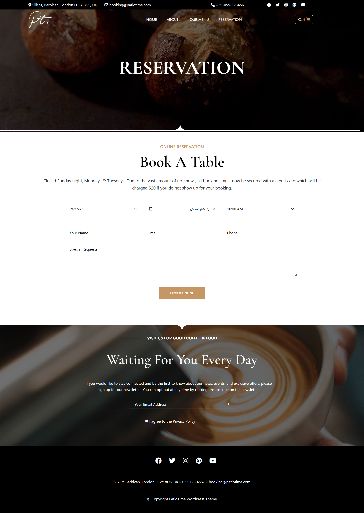

#  Coffee Passion

## ✨ Project Overview
This project is a dynamic and user-friendly web application built using **JavaScript**, **Bootstrap**, and **jQuery**.  
The goal was to create an interactive, visually appealing, and responsive interface that enhances user experience and improves workflow efficiency.

---

## 🔨 My Contributions

### 1️⃣ JavaScript  
I utilized JavaScript to implement core functionality including:  
- Client-side validation  
- Asynchronous operations  
- Dynamic content update  
- Smooth and interactive UI behaviors  

### 2️⃣ Bootstrap  
Using Bootstrap, I built a responsive and mobile-friendly layout with:  
- Adaptive grid system  
- Pre-built UI components  
- Uniform styling across all screen sizes  

### 3️⃣ jQuery  
jQuery was used to simplify DOM interactions and enhance the user experience through:  
- Efficient event handling  
- Smooth animations  
- Lightweight operations for improved performance  

---

## 🌟 Key Achievements
- **Improved User Satisfaction:** Delivered a clean and intuitive interface that made navigation simpler and more enjoyable.  
- **Streamlined Workflow:** Implemented seamless data handling and UI responsiveness to make user tasks more efficient.  
- **Cross-Device Compatibility:** Ensured full responsiveness across all modern devices using Bootstrap’s flexible components.

---

## 👨‍💻 Technologies Used
- **HTML**
- **CSS**
- **JavaScript**
- **Bootstrap**
- **jQuery**

---

## 📸 Pages Preview  
Below are previews of the main pages used in the project.  
*(Make sure the image paths match your project’s assets folder.)*

### 🏠 Home Page  

### 📄 About Page  

### 🍽️ Our Menu Page  

### 📅 Reservation Page  

